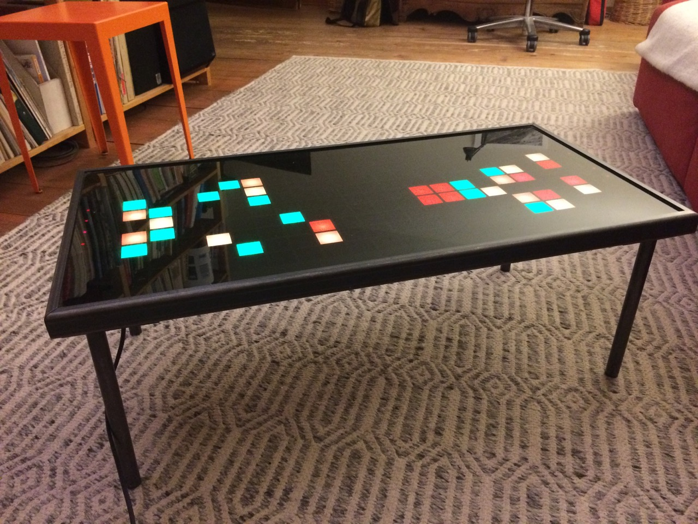

# Pixelboard Hardware

The **Pixelboard** is a 80*40cm lounge table board only 24mm thick, integrating a 10x20 color pixel matrix, 8 touch keys, a linux controller with WiFi and ethernet and even a power supply. All disguised under a dark plexiglass, looking like a regular lounge table until touched...

With the current software (see [pixelboardd](https://github.com/plan44/pixelboardd) and [pixelboard-config in plan44-feed](https://github.com/plan44/plan44-feed/tree/for-lede-master/pixelboard-config)) you can play tetris (alone or 2 players each on one end of the board), watch Conway's game of life, let text messages scroll over the surface and display small 10x20 pixel PNG images (via web interface).

The board itself is made of 5 layers of lasered plywood and plexiglass. The construction plan is a [Affinity Designer](https://affinity.serif.com/en-us/designer/) drawing in `mechanics/` and there are SVG exports of the layers in `mechanics/exported SVGs for laser/`.

The pixels are made of 33mm spaced WS2813 LED strips, arranged in a 10*20 matrix, all power and data lines connected by two narrow PCBs (see KiCAD files in `electronics/connectorboard`, PCBs can be [ordered here](https://oshpark.com/shared_projects/2NEbDGZJ)). The board is designed such that it works for both sides of the matrix (flipped over at the far end).

The control board is built around a [Onion Omega2](https://onion.io/omega2/), a MediaTek MT7688 based MIPS board with built-in WiFi, 64MB RAM and 16MB Flash, running a LEDE/OpenWRT Linux based firmware (see [here](https://github.com/plan44/plan44-feed/blob/for-lede-master/pixelboard-config/README.md) for how to build the firmware from scratch). The KiCAD files are in `electronics/controlboard`, PCBs can be [ordered here](https://oshpark.com/shared_projects/cvgoJ8vJ)).

The two identical touch key boards are based on the AT42QT1070 chip for handling the touch detection plus a i2c port extender for connecting the indicator LEDs placed in the middle under each touch key. The KiCAD files are in `electronics/touchboard`, PCBs can be [ordered here](https://oshpark.com/shared_projects/GfQ63cgI)).

And in `photos` there are a few images showing various states of assembling all this:

Front glass removed

Controlboard side, just base plate and first lasered frame (lower carrier) keeping the LED matrix, cables, and controlboard in place.

Power supply side, base plate and lower carrier.

Power supply side, now with all plywood layers and touchboard mounted.

Controlboard side, all plywood layers mounted, diffusor plexi sqares inserted, touchboard mounted. Note that this photo does not yet show the hole for a little speaker connected to the MAX98357A i2s amp (but the plan drawings have it).